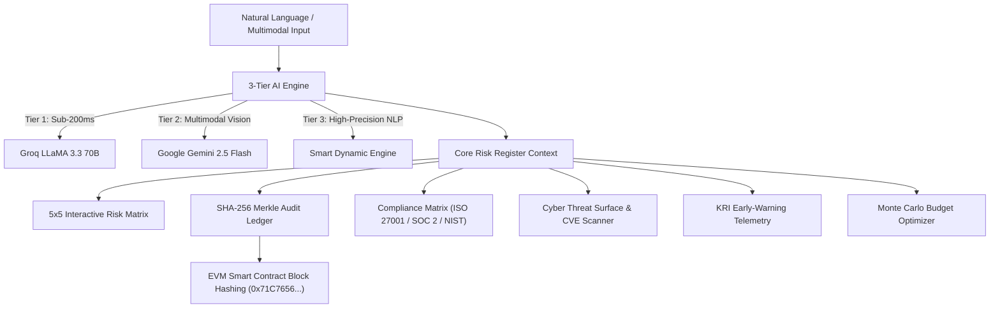

# 🛡️ Risk Register Copilot — AI Business Operations & Immutable Audit Ledger Platform

[](https://risk-register-copilot.vercel.app/)
[](https://github.com/itzdevilsunny/aiot.git)
[-000000?style=for-the-badge&logo=next.js&logoColor=white)](https://nextjs.org/)
[](https://www.typescriptlang.org/)
[](https://risk-register-copilot.vercel.app/audit-ledger)

> **Enterprise AI Risk Register Copilot** is a state-of-the-art Business Operations & Risk Management Platform. It converts unstructured operational, financial, and cybersecurity threats into quantitative risk registers powered by a **3-Tier AI Engine** (Groq LLaMA 3.3 70B $\rightarrow$ Google Gemini 2.5 Flash $\rightarrow$ Smart Dynamic Engine) and secured by an **EVM Blockchain Immutable Audit Ledger**.

---

## 🌐 Live Prototype & Interactive Module Links

| Enterprise Module | Live Prototype URL | Description |
| :--- | :--- | :--- |
| 📊 **Executive Dashboard** | [`https://risk-register-copilot.vercel.app/`](https://risk-register-copilot.vercel.app/) | Interactive 5x5 Severity Heatmap, Financial Exposure Counter & Boardroom Mode. |
| ⛓️ **Blockchain Audit Ledger** | [`https://risk-register-copilot.vercel.app/audit-ledger`](https://risk-register-copilot.vercel.app/audit-ledger) | Cryptographic SHA-256 Merkle root hash verification & EVM block inspection. |
| 📜 **Compliance Governance** | [`https://risk-register-copilot.vercel.app/compliance`](https://risk-register-copilot.vercel.app/compliance) | ISO 27001, SOC 2, NIST SP 800-30 & GDPR audit matrix with SoA generator. |
| 🛡️ **Cyber Threat Surface** | [`https://risk-register-copilot.vercel.app/threat-surface`](https://risk-register-copilot.vercel.app/threat-surface) | CVE Vulnerability intelligence scanner & security posture rating (44/100). |
| 📈 **KRI Telemetry Studio** | [`https://risk-register-copilot.vercel.app/kri`](https://risk-register-copilot.vercel.app/kri) | 7-Day anomaly drift sparklines & SLA breach prediction triggers. |
| 💵 **Mitigation ROI Optimizer** | [`https://risk-register-copilot.vercel.app/roi`](https://risk-register-copilot.vercel.app/roi) | Monte Carlo capital portfolio allocation slider & CFO investment memo exporter. |
| 🔮 **Predictive Threat Radar** | [`https://risk-register-copilot.vercel.app/radar`](https://risk-register-copilot.vercel.app/radar) | 12-Month financial loss trajectory actuarial forecasting engine. |
| 🕸️ **Cascading Threat Graph** | [`https://risk-register-copilot.vercel.app/cascade`](https://risk-register-copilot.vercel.app/cascade) | Upstream-to-downstream failure blast-radius graph & circuit breaker. |

---

## 🏗️ System Architecture



---

## 🌟 Key Features & Capabilities

### 1. 📊 Executive Dashboard & Heatmap (`/`)

- **Interactive 5x5 Matrix**: Categorizes risks into 25 probability-impact coordinate cells with severity indicators (**Critical**, **High**, **Medium**, **Low**).
- **Copilot Executive Briefings**: AI-synthesized operational summary of top enterprise threats and velocity shifts.
- **Boardroom Mode**: Distraction-free full-screen mode tailored for Board of Directors and C-suite meetings.

### 2. 🧠 Multimodal Natural Language Ingestion (`/add`, `/register`)

- **Natural Language Threat Parser**: Automatically quantifies probability ($1\dots5$), impact ($1\dots5$), severity, USD exposure, and 5-step action checklists from raw text.
- **Multimodal Vision Analysis**: Upload server rack photos or network diagrams to extract threats automatically via Gemini 2.5 Flash.
- **Voice Dictation**: Built-in Web Speech API voice threat entry.
- **AI Bulk CSV Importer**: Auto-detects columns from legacy spreadsheets and classifies risk parameters.

### 3. ⛓️ EVM Blockchain Immutable Audit Ledger (`/audit-ledger`)

- **SHA-256 Merkle Tree Hash Generation**: Computes root hashes (`computeRiskMerkleRoot`) to seal all risk creations and status updates.
- **EVM Block Inspection**: Inspect simulated EVM smart contract blocks (`0x71C7656EC7ab88b098defB751B7401B5f6d8976F`) with downloadable JSON audit packages.
- **On-Chain Badges**: Interactive `On-Chain: 0x...` verification seals embedded across navigation and risk detail cards.

### 4. 📜 Compliance & Regulatory Matrix (`/compliance`)

- **Multi-Framework Audit**: Real-time compliance rating (91% baseline) mapped to ISO 31000, ISO 27001:2022, NIST SP 800-30, SOC 2, and GDPR.
- **ISO 27001 Statement of Applicability (SoA) Exporter**: Generates formal SoA documentation packages.
- **CISO Certificate Generator**: Downloadable governance certificate validating risk posture.

### 5. 🛡️ Cyber Threat Surface & CVE Mapper (`/threat-surface`)

- **Posture Rating Scorecard**: Security Rating (44/100) across monitored domain vectors.
- **CVE Intelligence Scanner**: Cross-references infrastructure tech stacks against active CVE vulnerability databases.
- **Automated Hardening Runbooks**: Converts security gaps into actionable risk mitigations with one click.

### 6. 🌙 Dynamic Dark / Light Theme & Enterprise Styling

- **Compact Header Switcher**: Instant theme toggle button (`Sun` / `Moon`) with root CSS variable color inversion.
- **Typography & Aesthetics**: Styled with **Plus Jakarta Sans** for UI typography and **JetBrains Mono** for technical hashes/IDs.

---

## 🛠️ Tech Stack & Dependencies

- **Frontend & App Router**: [Next.js 16](https://nextjs.org/) (Turbopack, React 19, TypeScript 5.7)
- **AI Engine Architecture**: `@google/genai` (Gemini 2.5 Flash), Groq LLaMA 3.3 70B SDK
- **Database & Sync**: Supabase Cloud (`@supabase/supabase-js`, `@supabase/ssr`)
- **Styling & Icons**: Tailwind CSS, Lucide React, Plus Jakarta Sans, JetBrains Mono
- **Analytics & Data Visuals**: Recharts
- **Cryptography**: Native Web Crypto API (SHA-256 Merkle Tree)

---

## 🚀 Local Development Setup

### 1. Prerequisites

- **Node.js**: 18.18.0 or higher
- **Package Manager**: npm (v9+)

### 2. Installation

```bash
# Clone the repository
git clone https://github.com/itzdevilsunny/aiot.git

# Navigate into the project directory
cd aiot

# Install dependencies
npm install
```

### 3. Environment Variables Configuration

Create a `.env.local` file in the root directory:

```env
NEXT_PUBLIC_SUPABASE_URL=https://nrymxphrspvxhacevvwr.supabase.co
NEXT_PUBLIC_SUPABASE_ANON_KEY=your_supabase_anon_key
GROQ_API_KEY=your_groq_api_key
GEMINI_API_KEY=your_gemini_api_key
```

### 4. Run Development Server

```bash
npm run dev
```

Open [http://localhost:3000](http://localhost:3000) in your browser.

---

## 📄 License

This project is licensed under the MIT License — see the [LICENSE](LICENSE) file for details.
